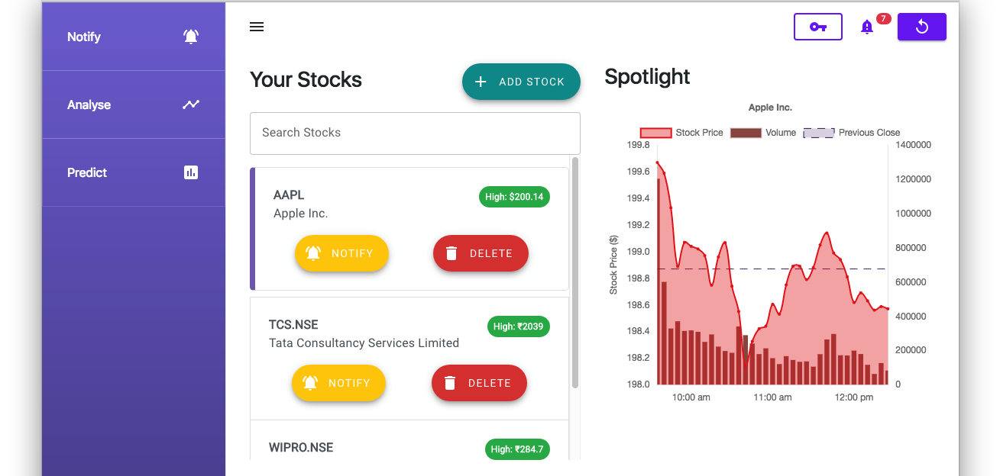
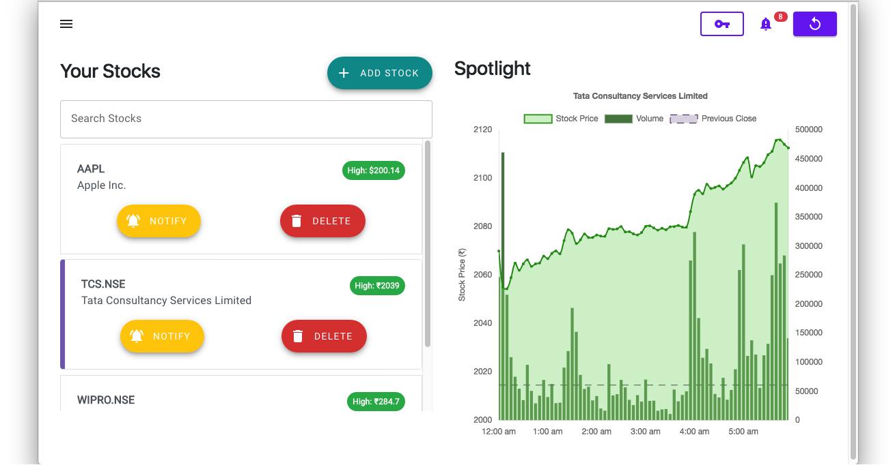
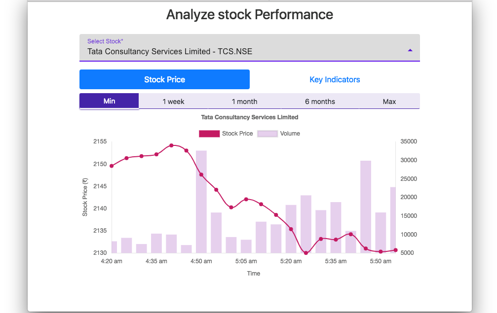
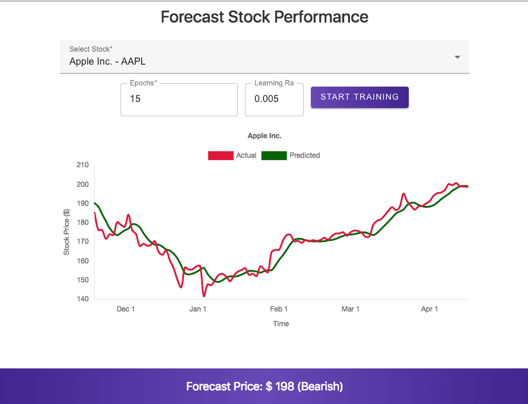
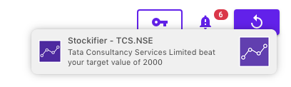
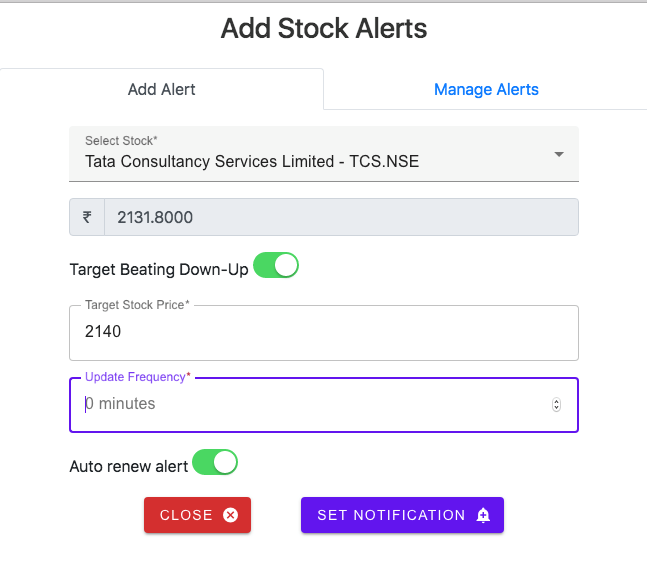

# Stocker 
### A insights app for stock markets

# Features
* Real time stock alerts and updates through desktop notifications
* Visualization of stock prices and key indicators
* Stock forecasts and predictions through machine learning
* In-built database to store all your monitored stocks

# Screenshots

# Built With
- Electron
- HTML5
- CSS3
- Node.js
- Express
- Chart.js
- sqlite3
- Tensorflow JS
- Bootstrap Components
  
# Contributing

### Prerequisites:
* Node.js and NPM
* Python 3 (for packaging and distribution)

### Configuring development environment
Once you have cloned/downloaded the repository, run the `npm install` command in the root directory. This should install all the required packages including Electron.

Once complete, you may run the `npm start` command to launch the Electron window and start the app.

# Special Tools and API :

1. [AlphaVantage API](https://www.alphavantage.co/) - \
([NPM Package](https://www.npmjs.com/package/alphavantage)) alphavantage

2. [TensorFlow JS](https://www.tensorflow.org/js)

# LICENSE
Licensed under MIT. Please view [LICENSE](https://github.com/msi-end/Stocker/blob/master/LICENSE) for more details.

